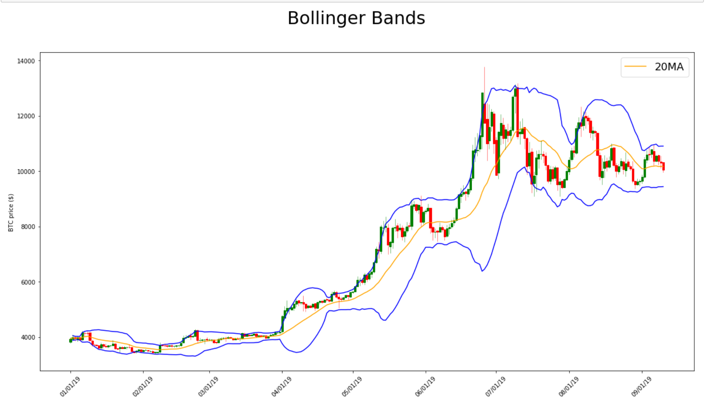
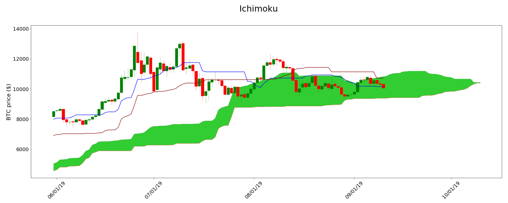

# TA-charts

This repository provides technical tools to analyze OHLCV data, along with several TA chart functionalities.  These functions are optimized for speed and utilize numpy vectorization instead of built-in pandas methods.

TA charting tools:
* Ichimoku
* Bollinger Bands
* Renko

Technical tools (located in `ta.py`):
* `sma(close, n=14)`: simple moving average for a list of `close` prices across `n` periods
* `rolling_sum(list, n=20)`: rolling sum for a list across `n` periods
* `ema(close, n=2)`: exponential moving average for a list of `close` prices across `n` periods
* `macd(close, fast=8, slow=21)`: moving average convergence/divergence for a list of `close` prices
* `atr(high, low, close, n=14)`: average true range from candlestick `high`, `low`, and `close` prices across `n` periods
* `roc(close, n=14)`: rate of change in `close` prices across `n` periods
* `rsi(close, n=14)`: relative strength index in `close` prices across `n` periods
* `td_sequential(close, n=4)`: TD sequential of `close` prices across `n` periods
* `chaikin_money_flow(df, n=20)`: Chaikin Money Flow of an OHLCV dataset

Additional tools (located in `utils.py`):
* `group_candles(df, interval)`: combine candles so instead of needing a different dataset for each time interval, you can form time intervals using more precise data.
  * Example: you have 15-min candlestick data but want to test a strategy based on 1-hour candlestick data (`interval=4`).
* `fill_values(averages, interval, target_len)`: Fill missing values with evenly spaced samples.
  * Example: You're using 15-min candlestick data to find the 1-hour moving average and want a value at every 15-min mark, and not every 1-hour mark.
* `crossover(x1, x2)`: find all instances of intersections between two lines
* `intersection(a0, a1, b0, b1)`: find the intersection coordinates between vector A and vector B
* `area_between(line1, line2)`: find the area between line1 and line2
* `maxmin(max_or_min, *args)`: compare lists and return the max or min value at each index


### How it works

```python
import pandas as pd
%matplotlib inline

# NOTE: File should contain the columns 'date', 'open', 'high', 'low', and 'close'
df = pd.read_csv('../Daily.csv')
```

#### Bollinger Bands
```python
from bollinger import Bollinger

b = Bollinger(df)
b.build(n=20)
b.plot()
```


#### Ichimoku
```python
from ichimoku import Ichimoku

i = Ichimoku(df)
i.build(20, 60, 120, 30)

i.plot()
```



#### Renko
```python
from renko import Renko

r = Renko(df)
r.set_brick_size(auto=True, atr_period=14)
r.build()

r.plot()
```

